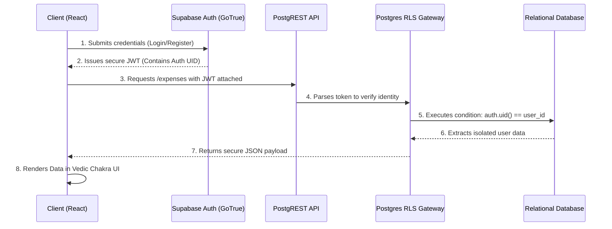
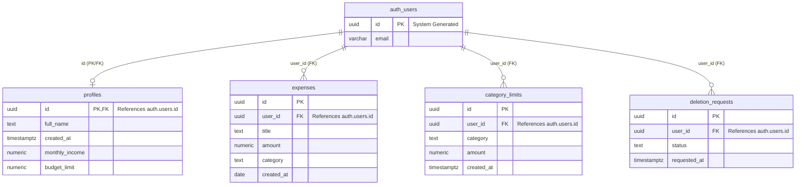

# 🖋️ ePramana (प्रमाणार्थ): The Analytics of Your Wealth

**ePramana** is a highly secure, modern personal finance application built with React and Supabase. Moving beyond generic expense tracking, it integrates an Enterprise Zero-Trust Security Architecture and features a unique सनातन (Vedic View) engine.

## 🏗️ System Architecture

### Frontend–Backend Data Flow

### Entity–Relationship Schema

