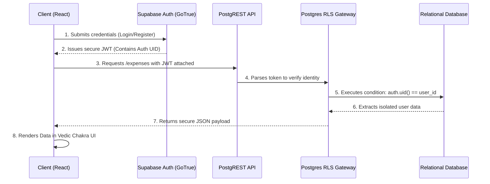
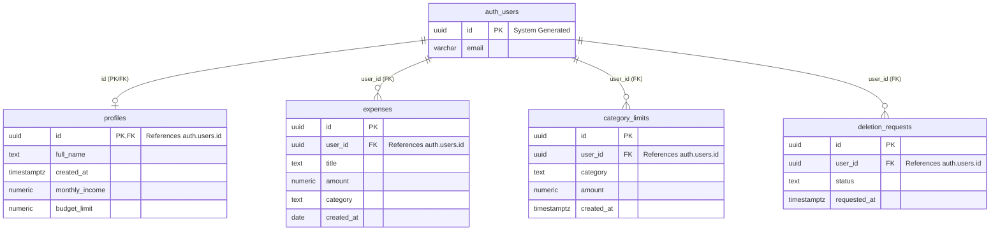

# 🖋️ ePramana (प्रमाणार्थ): The Analytics of Your Wealth


**ePramana** is a highly secure, modern personal finance application built with React and Supabase. Moving beyond generic expense tracking, it integrates an Enterprise Zero-Trust Security Architecture and features a unique सनातन (Vedic View) engine—mapping modern financial data to the ancient Hindu Lunisolar calendar and Nalanda economic principles.

---

## ✨ Enterprise Core Architecture

### 🕉️ सनातन (Vedic) Analytics Engine
A dedicated architectural view that translates standard Gregorian data into the ancient Indian financial framework:
* **Native Lunisolar Mapping:** Utilizes the browser's native `en-IN-u-ca-indian` API to mathematically convert standard dates into exact Saka/Vikram Samvat calendar months (e.g., Phalguna, Chaitra).
* **Sanskrit Categorization:** Maps modern categories into ancient financial structures (*Aaya*, *Vyaya*, *Sanchaya*).
* **Sacred Geometry Data Viz:** Features a custom-built Recharts Donut graph perfectly framing a pure SVG 24-spoke Ashoka Chakra to represent cyclical expenditure.

### 🛡️ Zero-Trust Security & Routing
* **Protected Routes & Recovery:** Utilizes React Router DOM for strictly protected dashboard access, complete with secure URL-token password recovery flows.
* **Password-Gated Credentials:** A multi-step profile modal that strictly requires the user's current password to generate a 6-digit OTP for email updates.
* **Enterprise Account Deletion:** A legally compliant "Soft Delete" danger zone requiring active consent and password verification. It generates an Admin Review Ticket (`deletion_requests`), preventing accidental data loss or malicious account hijacking.
* **Row Level Security (RLS):** Strict Postgres database policies ensuring data isolation across the multi-tenant architecture. No user can query another's ledger.

---

## 🏗️ System Architecture

### Frontend–Backend Data Flow



### Entity–Relationship Schema



---

## 🛠️ Tech Stack
* **Frontend:** React.js, Tailwind CSS, Lucide React (Icons)
* **Data Visualization:** Recharts
* **Backend as a Service (BaaS):** Supabase (PostgreSQL, GoTrue Auth)
* **Routing:** React Router DOM

---

## 🚀 Getting Started

### Prerequisites
* Node.js installed on your local machine
* A Supabase account and project

### Installation & Setup

**1. Clone the repository:**
```bash
git clone [https://github.com/yourusername/epramana.git](https://github.com/yourusername/epramana.git)
cd epramana
```

**2. Install dependencies:**
```bash
npm install
```

**3. Configure Environment Variables:**
Create a `.env` file in the root directory and add your Supabase credentials:
```env
REACT_APP_SUPABASE_URL=your_supabase_project_url
REACT_APP_SUPABASE_ANON_KEY=your_supabase_anon_key
```

**4. Run the development server:**
```bash
npm start
```

---

## 🗄️ Database Schema Outline
The application relies on a strictly relational Supabase Postgres architecture:
* **`profiles`**: Securely links to `auth.users`, storing display names and global financial parameters.
* **`expenses`**: The core ledger tracking exact amounts, relational categories, and timestamps.
* **`category_limits`**: User-defined financial thresholds for individual spending categories.
* **`deletion_requests`**: An isolated security table acting as a holding area for account termination requests.

---

📄 **License**
This project is licensed under the MIT License - see the LICENSE file for details.